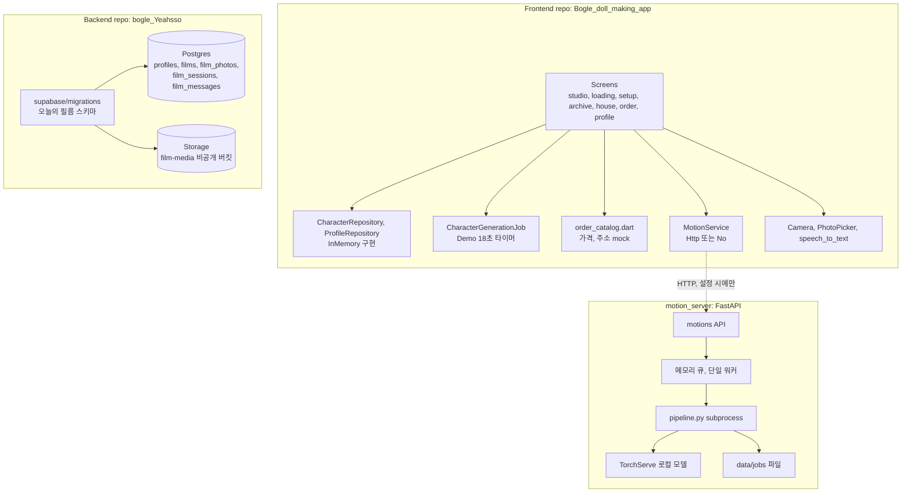
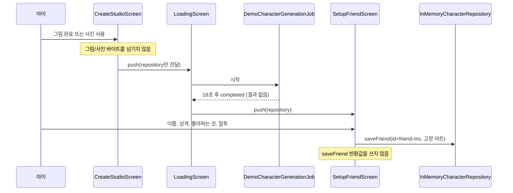
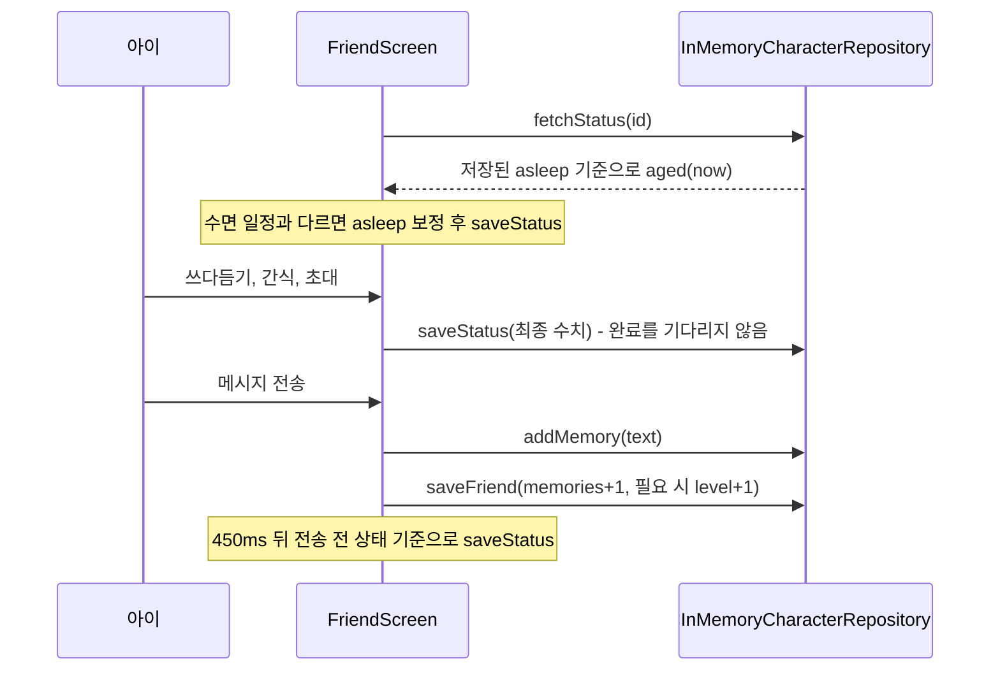
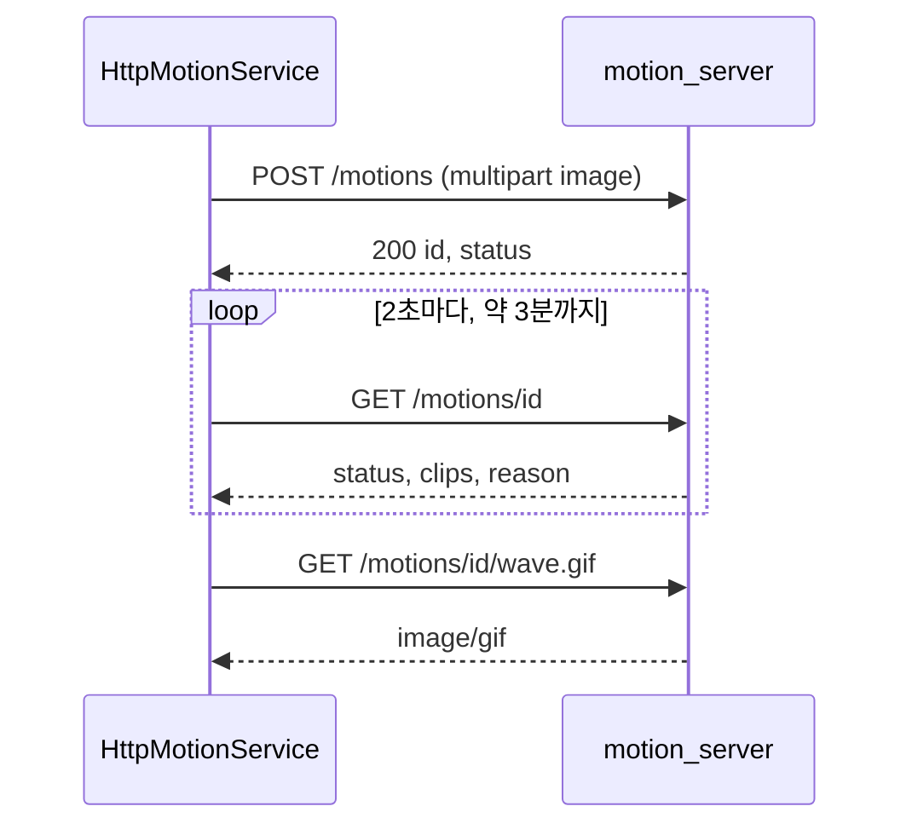
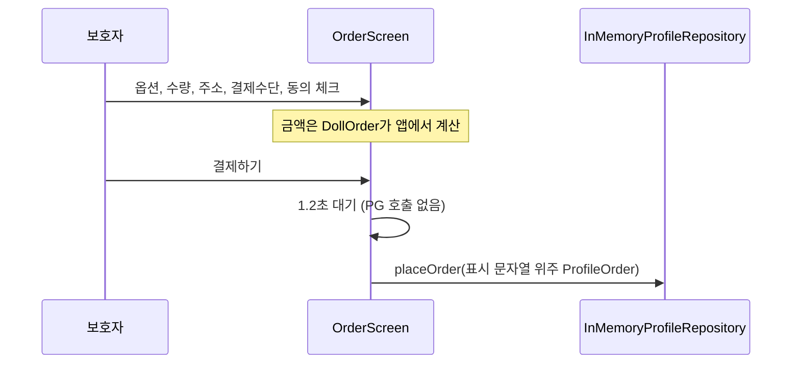

# System Architecture

## System Overview

현재(As-Is) 보글 시스템은 서로 연결되지 않은 세 덩어리로 이루어져 있다.

1. **Flutter 앱** — 모든 데이터를 메모리 저장소에 둔다. 로그인·DB·일반 서비스 API가 없다.
2. **모션 서버** — 앱이 `MOTION_SERVER` 설정을 받았을 때만 호출하는 FastAPI 서비스. 인증·사용자 격리가 없다.
3. **백엔드 워크스페이스(Supabase)** — 다른 제품("오늘의 필름")의 스키마 마이그레이션만 있다. 앱과 연결되어 있지 않다.

따라서 보글 백엔드는 사실상 **새로 설계·구축해야 하는 대상**이며, 기존 Supabase 마이그레이션은 기술 스택 후보이자 패턴 참고 자료다.

## Architecture Diagram

**텍스트 대안**:
- Frontend: 화면 → 메모리 저장소 / 데모 생성 작업 / 주문 mock / 모션 클라이언트 / 기기 기능(카메라·사진·음성)
- 모션 클라이언트 → (선택) 모션 서버 API → 메모리 큐 → 파이프라인 subprocess → TorchServe, 결과는 로컬 파일
- Backend repo: 마이그레이션 → Postgres 테이블 5개 + Storage 버킷 1개. **Frontend와 연결 없음**

## Component Descriptions

### Flutter 앱 데이터 경계 (`lib/src/data`, `lib/src/models`)
- **Purpose**: 화면과 저장 사이의 경계.
- **Responsibilities**: 친구 CRUD, 추억 추가, 상태 조회·저장, 프로필·주문 조회·저장, 생성 작업 완료 대기, 모션 클립 요청.
- **Dependencies**: 없음 (메모리 구현). 모션만 HTTP.
- **Type**: Application (Client)

### Flutter 앱 화면 (`lib/src/screens`)
- **Purpose**: 사용자 흐름 전체의 UI.
- **Responsibilities**: 게임 규칙(상태 증감, 수면 전환, 성장)도 화면 코드 안에서 계산한다. `friend_screen.dart`가 돌봄·초대·대화·성장·수면을 모두 담당한다.
- **Dependencies**: 데이터 경계, 기기 플러그인(`camera`, `image_picker`, `speech_to_text`).
- **Type**: Application (Client)

### 모션 서버 (`motion_server/app.py`, `pipeline.py`)
- **Purpose**: 그림 → 움직임 GIF.
- **Responsibilities**: 업로드 크기 검사(12 MiB), SHA-256 앞 16자리로 작업 ID, `failed` 재업로드 시 재실행, 300초 실행 제한, 재시작 시 결과 없는 작업 다시 등록.
- **Dependencies**: FastAPI, uvicorn, python-multipart, 로컬 TorchServe.
- **Type**: Application (Service)

### Supabase 스키마 (`supabase/migrations`)
- **Purpose**: "오늘의 필름" 데이터 저장.
- **Responsibilities**: 테이블 5개, 트리거 3개(`updated_at` 2개 + Auth 사용자 생성 시 프로필), 소유자 RLS 정책, 비공개 Storage 버킷과 경로 기반 정책.
- **Dependencies**: Supabase Auth(`auth.users`), Supabase Storage(`storage.objects`).
- **Type**: Infrastructure / Model

## Data Flow

### 1) 친구 만들기 (As-Is)

### 2) 돌봄과 대화 (As-Is)

### 3) 움직임 클립 (As-Is, 구현됨)

### 4) 인형 주문 (As-Is)

## Integration Points
- **External APIs**: 모션 서버(선택, 인증 없음). 그 외 없음.
- **Databases**: 앱 쪽 없음(메모리). 백엔드 워크스페이스에 Supabase Postgres 스키마가 있으나 다른 도메인이고 앱과 연결되어 있지 않음.
- **Third-party Services**: iOS 카메라·사진 보관함(권한 문구는 `Info.plist`에 추가됨), iOS 음성 인식(`speech_to_text`, 한국어 받아쓰기 — 서버로 음성 전송 없음), TorchServe 로컬 모델(모션). 결제·친구 생성 AI·제작/택배 연동은 없음.

## Infrastructure Components
- **IaC (CDK/Terraform/CloudFormation)**: 없음.
- **Deployment Model**: Supabase CLI(`supabase db push`)로 마이그레이션 적용하는 방식만 README에 서술. 원격 프로젝트 연결 정보·`config.toml`·CI 없음. 모션 서버는 `setup.sh`/`run.sh`로 단일 호스트에서 실행.
- **Networking**: 정의 없음. 모션 서버는 HTTPS·프록시 없이 직접 노출하는 구성.
