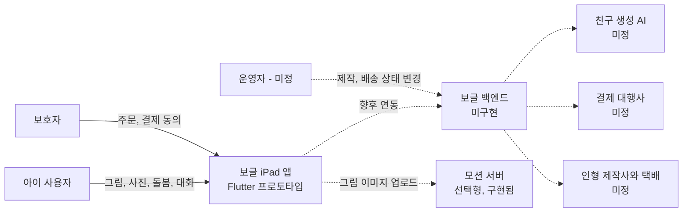

# Business Overview

> **분석 범위**: (1) 백엔드 워크스페이스 `bogle_Yeahsso/supabase/` 전체, (2) 프론트엔드 저장소 `Bogle_doll_making_app`의 `origin/main-develop` @ `daabf83` (2026-09-28)를 읽기 전용으로 분석. PRD(`BACKEND_HANDOFF_PRD.md`, 기준 `9c7ba17`)의 서술은 코드로 다시 확인했으며, 다른 부분은 "PRD 이후 변경"으로 표시했다.

## Business Context Diagram

**텍스트 대안**: 아이는 앱에서 그림·사진·돌봄·대화를 하고, 보호자는 주문·결제 동의를 한다. 현재 앱이 실제로 호출하는 외부 서버는 선택형 모션 서버뿐이다. 보글 백엔드, 친구 생성 AI, 결제 대행사, 제작사/택배, 운영자 경로는 모두 아직 없다(점선).

## Business Description

- **Business Description**: 보글은 아이가 iPad에서 그린 그림이나 종이 그림을 찍은 사진을 "친구" 캐릭터로 만들고, 이름·성격·좋아하는 것·말투를 정한 뒤 친구의 집에서 돌봄과 대화로 관계를 쌓는 앱이다. 마음에 드는 친구는 실물 인형으로 주문할 수 있다. 현재 앱은 모든 데이터를 메모리에만 두는 프론트엔드 프로토타입이며, 재실행하면 데모 데이터로 초기화된다.

- **Business Transactions** (상태: ✅ 구현 / 🟡 UI·메모리만 / ⛔ 없음):

| ID | 거래 | 현재 상태 | 근거 |
|---|---|---|---|
| BT-01 | 그림판에서 그리기 (펜·형광펜·지우개·확대·되돌리기, Apple Pencil, 도형 인식) | 🟡 그림이 메모리에만 있고 내보내기 없음 | `create_studio_screen.dart`, `drawing/` |
| BT-02 | 종이 그림 촬영 / 사진 보관함에서 선택 후 편집 | 🟡 JPEG 바이트는 만들지만 `_createFromPhoto(photo) => _create()`에서 버려짐 | `studio_camera.dart`, `photo_capture.dart`, `photo_edit.dart` |
| BT-03 | 친구 생성 대기 (AI 생성) | 🟡 `DemoCharacterGenerationJob` 18초 타이머. 결과 없음 | `character_generation.dart`, `loading_screen.dart` |
| BT-04 | 친구 설정과 탄생 (이름→성격→좋아하는 것→말투) | 🟡 고정 아트(`_art`)와 기기 시각 기반 ID로 메모리 저장 | `setup_friend_screen.dart` `_befriend` |
| BT-05 | 보관함: 목록·찜·수정·삭제·다시 데려오기 | 🟡 메모리. 복구 시 상태·추억은 돌아오지 않음 | `archive_screen.dart` |
| BT-06 | 친구의 집 돌봄: 쓰다듬기·간식·초대·자동 수면 | 🟡 모든 계산을 앱에서 함 | `friend_screen.dart` |
| BT-07 | 대화와 성장: 메시지 1건마다 추억 +1, 5개마다 레벨 +1 | 🟡 스크립트 대사, 메모리 저장 | `friend_screen.dart` `_send`, `friend_talk.dart` |
| BT-08 | 움직임 클립 (jump/wave/dance GIF) | ✅ `MOTION_SERVER` 설정 시 실제 HTTP 호출, 실패하면 기본 애니메이션 | `motion_service.dart`, `motion_server/` |
| BT-09 | 인형 주문·결제 | 🟡 1.2초 대기 후 메모리 주문 생성. PG 호출 없음 | `order_screen.dart` `_pay`, `order_catalog.dart` |
| BT-10 | 주문 내역·상태 확인 (마이페이지) | 🟡 데모 주문 3건, 상태가 바뀌는 경로 없음 | `orders_section.dart` |
| BT-11 | 프로필 (닉네임·아바타·알림 설정) | 🟡 메모리 | `profile_repository.dart`, `profile_editor.dart` |
| BT-12 | 인증·계정·데이터 소유권 | ⛔ 없음 | — |

- **Business Dictionary**:

| 용어 | 코드 이름 | 의미 |
|---|---|---|
| 친구 | `CharacterFriend` | 그림에서 태어난 캐릭터. 이름·성격·소개·좋아하는 것·말투·아트·대표색·레벨·추억 수·수면 일정을 가진다 |
| 소개 | `introduction` | **PRD 이후 추가.** 보관함 카드에 보이는 정체성 문구. 비어 있으면 기본 문구를 표시. 수정 화면에서 최대 70자 |
| 성격 | `personality` | 기질 서술. 생성 시 필수, 최대 30자. 수정 시 빈 값 허용 |
| 좋아하는 것 | `favoriteThings` | 생성 시 1개 이상 선택. 수정 화면에서는 바꿀 수 없음. 간식 취향 판정에 쓰임 |
| 말투 | `speechStyle` | 저장값 `~지요!`, `해요체`, `반말`. 데모 친구에는 자유 서술형 값도 있음 |
| 수면 일정 | `SleepSchedule` | **PRD 이후 추가.** 친구별 취침/기상 시각(자정 기준 분). 기본 21:00–07:00. 이 일정에 따라 스스로 잠들고 깸 |
| 친구 상태 | `FriendStatus` | 기분 `mood`·배부름 `fullness`·기운 `energy`·친밀도 `closeness`(0–100), `asleep`, `updatedAt` |
| 추억 | memory | 사용자가 보낸 대화 텍스트. 1건마다 추억 수 +1 |
| 레벨 | `level` | 추억 수가 5의 배수가 될 때마다 +1 |
| 찜 | `likedFriendIds` | 프로필에 저장된 하트 표시 친구 ID 집합. 보관함과 마이페이지 타일에서 같이 씀 |
| 초대 | invite / guest | **PRD 이후 추가 (비눗방울 놀이 대체).** 내 다른 친구를 집에 손님으로 부름. 도착하면 집주인의 기분·친밀도가 오름 |
| 간식 | `Snack` | 사과·도토리·쿠키·딸기 |
| 좋아하는 간식 | `isFavouriteOf` | `favoriteThings` 중 하나라도 간식 이름을 포함하면 좋아하는 간식으로 판정 |
| 생성 작업 | `CharacterGenerationJob` | 친구 생성 대기를 나타내는 추상화. 현재 완료/취소만 있고 결과 데이터가 없음 |
| 모션 클립 | `MotionClipKind` | `jump`·`wave`·`dance` GIF. 쓰다듬기→wave, 좋아하는 간식→jump |
| 인형 주문 | `DollOrder` | 친구 1명 × 동일 옵션 × 수량 1–5 |
| 보호자 동의 | checkbox | "보호자가 주문 내용을 확인했고, 결제에 동의해요" 체크박스. 저장되지 않음 |

## Component Level Business Descriptions

### 백엔드 워크스페이스 `supabase/` (현재 워크스페이스)
- **Purpose**: **보글이 아닌 "오늘의 필름" 서비스**의 Supabase 초기 백엔드. 사용자가 사진과 AI 대화로 하루의 필름 기록을 만드는 도메인이다.
- **Responsibilities**: Auth 사용자당 프로필 자동 생성, 필름·사진·AI 대화 세션·메시지 저장, 소유자 기반 RLS, 비공개 Storage 버킷 `film-media`.
- **보글과의 관계**: 도메인 테이블은 보글과 맞지 않는다. 다만 Auth 연동 프로필 트리거, `(select auth.uid())` 기반 RLS, `{user_id}/...` Storage 경로 규칙, `search_path` 고정과 `security definer` 실행 권한 회수는 보글 백엔드에서 재사용할 수 있는 패턴이다.

### Flutter 앱 `Bogle_doll_making_app` (연관 저장소)
- **Purpose**: 보글의 iPad 가로 화면 앱. 모든 사용자 흐름의 UI와 프로토타입 규칙을 가진다.
- **Responsibilities**: 그림·촬영 입력, 생성 대기 연출, 친구 설정, 보관함, 친구의 집(돌봄·대화·성장·수면), 주문 UI, 마이페이지.
- **백엔드 연동 경계**: `CharacterRepository`, `ProfileRepository`, `CharacterGenerationJob`, `MotionService`, `order_catalog.dart`의 mock.

### 모션 서버 `motion_server/` (연관 저장소 하위)
- **Purpose**: 입력 그림 한 장으로 짧은 움직임 GIF(jump/wave/dance)를 만드는 선택형 서비스.
- **Responsibilities**: 업로드 받기, 콘텐츠 해시로 작업 ID 정하기, 단일 워커 메모리 큐, 파이프라인 subprocess 실행, GIF 제공.
- **보글 친구 생성과의 관계**: 별개 서비스다. 친구 생성(로딩 화면)·계정·주문 저장을 처리하지 않는다.
