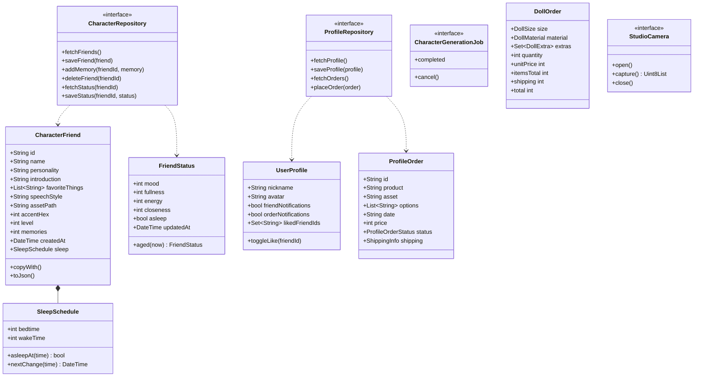

# Code Structure

## Build System
- **백엔드 워크스페이스**: Supabase CLI 마이그레이션 디렉터리(`supabase/migrations/`). `supabase/config.toml`, `seed.sql`, Edge Functions, 테스트가 없다. 로컬 실행은 README 기준 `supabase start` → `supabase db reset`.
- **Flutter 앱**: Flutter / pub. Dart SDK `^3.11.3`. 앱 버전 `1.0.0+1`. iOS 대상(`ios/`), 진입점 `lib/main.dart`.
- **모션 서버**: Python, `requirements.txt` (pip). `setup.sh`, `run.sh`, `torchserve.properties`.

## Key Classes/Modules

**텍스트 대안**: `CharacterFriend`는 `SleepSchedule`을 포함한다. `CharacterRepository`는 친구와 `FriendStatus`를, `ProfileRepository`는 `UserProfile`과 `ProfileOrder`를 다룬다. `CharacterGenerationJob`·`StudioCamera`는 독립 인터페이스, `DollOrder`는 가격 계산 값 객체다.

### Existing Files Inventory

#### 백엔드 워크스페이스 (수정 후보 — 현재 워크스페이스)
- `supabase/README.md` - "오늘의 필름" 데이터 구조·Storage 경로 규칙·RLS 원칙·마이그레이션 적용 방법·제외 기능 설명
- `supabase/migrations/20260712000100_initial_backend.sql` - 테이블 5개(`profiles`, `films`, `film_photos`, `reflection_sessions`, `reflection_messages`), 인덱스, `set_updated_at`·`handle_new_user` 트리거, 전 테이블 RLS 정책, `film-media` 버킷과 Storage 정책
- `supabase/migrations/20260712000200_harden_trigger_function.sql` - `handle_new_user()` 실행 권한을 `public`/`anon`/`authenticated`에서 회수, `reflection_messages(user_id)` 인덱스 추가
- `supabase/migrations/20260712000300_rename_reflection_tables.sql` - `reflection_*` → `film_*`로 테이블·제약·인덱스·정책 이름 변경
- `.DS_Store`, `supabase/.DS_Store` - macOS 메타데이터 파일 (불필요, `.gitignore` 없음)

#### Flutter 앱 백엔드 연동 지점 (연관 저장소, `origin/main-develop` 기준 — 참조용, 이 워크스페이스에서 수정하지 않음)
- `lib/src/app.dart` - `InMemoryCharacterRepository`, `InMemoryProfileRepository` 생성과 주입
- `lib/src/models/character_friend.dart` - `CharacterFriend`, `SleepSchedule`, `isPhotographedArt`(`/archive_` 경로 판정), `timeOfDayLabel`
- `lib/src/models/friend_status.dart` - `FriendStatus`와 시간 경과 규칙 `aged()`
- `lib/src/data/character_repository.dart` - 친구·추억·상태 저장소 인터페이스와 데모 친구 3명
- `lib/src/data/profile_repository.dart` - 프로필·찜·주문 모델과 저장소, 데모 주문 3건
- `lib/src/data/character_generation.dart` - 생성 작업 인터페이스, 18초 데모 작업
- `lib/src/data/studio_camera.dart` - **PRD 이후 추가.** 카메라(JPEG 캡처)·사진 보관함 선택 추상화
- `lib/src/data/order_catalog.dart` - 인형 옵션·가격·배송비·결제수단 enum, mock 주소 3곳, 배송 메모, 도착 예정일(+12일)
- `lib/src/data/motion_service.dart` - 모션 HTTP 클라이언트 (PRD 이후 변경 없음)
- `lib/src/data/friend_talk.dart` - 키워드 기반 스크립트 대사 (`welcome`/`bye` 주제 추가)
- `lib/src/screens/create_studio_screen.dart` - `_create()`, `_createFromPhoto()` — 입력 데이터를 넘기지 않음
- `lib/src/screens/loading_screen.dart` - 30초/75초 안내, 5분 실패 UI, 작업 완료 후 설정 화면 이동
- `lib/src/screens/setup_friend_screen.dart` - `_befriend()` 친구 생성 저장
- `lib/src/screens/archive_screen.dart` - 찜 토글, 삭제와 "다시 데려오기", 수정(이름·소개·성격·말투)
- `lib/src/screens/friend_screen.dart` - 돌봄·초대·수면 일정·대화·성장 규칙 전부
- `lib/src/screens/house/sleep_schedule_dialog.dart` - **PRD 이후 추가.** 수면 일정 편집
- `lib/src/screens/house/invite_tray.dart` - **PRD 이후 추가.** 초대할 친구 고르기
- `lib/src/screens/house/snacks.dart` - 간식 4종과 좋아하는 간식 판정
- `lib/src/screens/order_screen.dart` - 주문 단계 UI와 `_pay()`
- `lib/src/screens/profile_screen.dart`, `profile/*` - 마이페이지(보유 캐릭터·주문·설정). `liked_section.dart`는 **PRD 이후 삭제**
- `motion_server/app.py`, `pipeline.py` - 모션 API와 파이프라인

## Design Patterns

### Repository 인터페이스 + 메모리 구현
- **Location**: `CharacterRepository`, `ProfileRepository`
- **Purpose**: 백엔드로 교체할 수 있는 경계
- **Implementation**: `abstract interface class` + `InMemory*` 구현. 단, `saveFriend()` 하나가 생성·수정·성장·수면 일정 변경을 모두 처리하는 **전체 객체 덮어쓰기** 구조라 그대로 API로 옮기면 경합과 값 조작 문제가 생긴다.

### 비동기 작업 추상화
- **Location**: `CharacterGenerationJob`
- **Purpose**: 애니메이션 타이머가 아니라 작업 완료만 화면을 넘기게 함
- **Implementation**: `Completer<void>`. 결과 타입이 없어 생성물 전달을 위해 확장이 필요하다.

### 선택형 서비스 + 우아한 저하
- **Location**: `MotionService` (`HttpMotionService` / `NoMotionService`)
- **Purpose**: 모션 서버가 없거나 실패해도 핵심 흐름 유지
- **Implementation**: 설정이 없으면 No 구현, 실패하면 기본 애니메이션.

### 소유자 기반 RLS (백엔드)
- **Location**: 모든 public 테이블, `storage.objects`
- **Purpose**: 인증 사용자가 자기 데이터만 접근
- **Implementation**: `(select auth.uid()) = user_id` (initplan 캐싱 형태), 자식 테이블은 상위 소유권 `exists` 검사, Storage는 경로 첫 폴더 = `auth.uid()`.

### Auth 트리거로 프로필 생성 (백엔드)
- **Location**: `handle_new_user()` + `on_auth_user_created`
- **Purpose**: 가입 시 프로필 행 자동 생성
- **Implementation**: `security definer`, `set search_path = ''`, API 역할에서 실행 권한 회수.

### 콘텐츠 해시 작업 ID (모션 서버)
- **Location**: `motion_server/app.py`
- **Purpose**: 같은 입력의 중복 실행 방지·결과 재사용
- **Implementation**: 입력 바이트 SHA-256 앞 16자리. 사용자 격리가 없어 다른 사용자가 같은 그림을 올리면 같은 결과를 공유한다.

## Critical Dependencies

### Supabase (Postgres + Auth + Storage)
- **Version**: 명시 없음 (`config.toml` 없음)
- **Usage**: 백엔드 워크스페이스 전체
- **Purpose**: DB·인증·파일 저장 — 보글 백엔드 기술 스택 후보

### camera / image_picker (Flutter)
- **Version**: `camera ^0.12.0+2`, `image_picker ^1.2.3`
- **Usage**: `studio_camera.dart`
- **Purpose**: 종이 그림 촬영·사진 선택 — 업로드 입력의 출처

### FastAPI / uvicorn / python-multipart
- **Version**: `0.115.6` / `0.32.1` / `0.0.20`
- **Usage**: `motion_server/app.py`
- **Purpose**: 모션 HTTP API
