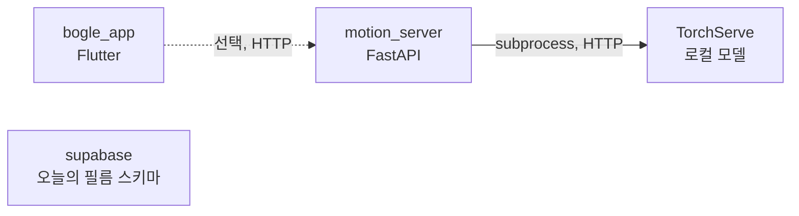

# Dependencies

## Internal Dependencies

**텍스트 대안**: `bogle_app`은 설정이 있을 때만 `motion_server`를 HTTP로 호출한다. `motion_server`는 로컬 TorchServe에 의존한다. `supabase`는 어떤 패키지와도 연결되어 있지 않다.

### bogle_app depends on motion_server
- **Type**: Runtime (선택)
- **Reason**: 친구 아트를 움직임 클립(jump/wave/dance)으로 바꾸기 위해. 서버가 없거나 실패하면 기본 애니메이션으로 대체

### motion_server depends on TorchServe
- **Type**: Runtime
- **Reason**: 파이프라인의 그림 분석·포즈 모델 실행. `/health`가 모델 목록을 조회

### bogle_app depends on supabase
- **Type**: 없음 (현재 연결 안 됨)
- **Reason**: 백엔드 연동이 이번 프로젝트의 목표

## External Dependencies

### Flutter 앱 (`origin/main-develop`의 `pubspec.yaml`)

| 패키지 | 버전 | 용도 | 라이선스 |
|---|---|---|---|
| `cupertino_icons` | `^1.0.8` | iOS 아이콘 | MIT |
| `flutter_svg` | `^2.2.4` | SVG 아트 렌더링 (`SvgAssetLoader`) | MIT |
| `speech_to_text` | `^7.4.0` | 이름·성격 등 한국어 받아쓰기 | BSD-3-Clause |
| `xml` | `^7.0.1` | SVG 파싱(아트 경계·얼굴 위치 계산 추정) | MIT |
| `camera` | `^0.12.0+2` | 종이 그림 촬영 | BSD-3-Clause |
| `image_picker` | `^1.2.3` | 사진 보관함 선택 | BSD-3-Clause |
| `url_launcher` | `^6.3.2` | 외부 링크 열기 | BSD-3-Clause |
| 폰트 Pretendard, Bagel Fat One | — | 본문·제목 서체 | SIL OFL 1.1 |

PRD 기준 커밋 `9c7ba17`에는 `cupertino_icons`, `flutter_svg`, `speech_to_text`만 있었다. `camera`, `image_picker`, `xml`, `url_launcher`는 **PRD 이후 `main-develop`에서 추가**되었다.

### 모션 서버 (`motion_server/requirements.txt`)

| 패키지 | 버전 | 용도 | 라이선스 |
|---|---|---|---|
| `fastapi` | `0.115.6` | HTTP API | MIT |
| `uvicorn` | `0.32.1` | ASGI 서버 | BSD-3-Clause |
| `python-multipart` | `0.0.20` | multipart 업로드 파싱 | Apache-2.0 |
| TorchServe 및 모델 | `setup.sh`에 따름 | 모션 파이프라인 | **확인 필요** — PRD 5절: 배포 환경의 렌더러·모델 실행 가능 여부와 의존성 사용 조건은 별도 검증 필요 |

### 백엔드 워크스페이스
- 외부 패키지 의존성 없음. Supabase 플랫폼(Postgres 확장 `gen_random_uuid()` 포함 — PG13+ 기본 제공)에만 의존.
